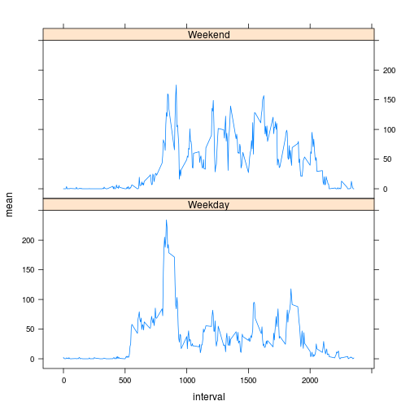

###Load and format data.


```r
library(plyr)
data <- read.csv("activity.csv")
byinterval <- ddply(data, c("interval"), summarise, mean = mean(steps, na.rm=T))
bydate <- ddply(data, c("date"), summarise, sum = sum(steps, na.rm =T))
```

###What is mean total number of steps taken per day?


```r
#Histogram of Steps taken per day
hist(bydate$sum)
```

 

```r
#Mean of steps taken per day
mean <- mean(bydate$sum)
#Median of steps taken per day
median <- median(bydate$sum, na.rm=T)
```
The mean steps taken per day is 9354.2295.

The median steps taken per day is 10395.

###What is the average daily activity pattern?

```r
plot(byinterval, type = "l")
```

 

```r
max <- which.max(byinterval$mean)
maxinterval <- byinterval$interval[max]
```
The time interval with the max. average steps is 835.

###Imputing missing values

```r
isna <- sapply(data$steps, is.na)
totalisna <- sum(isna)
```
A total of 2304 values are missing.

These values will be filled in by the mean (as interger) of the steps taken the interval they were supposed to be recorded.

```r
fixeddata <- data
for(i in which(is.na(data)==TRUE)) {
        ininterval <- fixeddata$interval[i]
        fixeddata$steps[i] <- as.integer(byinterval$mean[byinterval$interval==ininterval])
        
        }
newbydate <- ddply(fixeddata, c("date"), summarise, sum = sum(steps, na.rm =T))
newbyinterval <- ddply(fixeddata, c("interval"), summarise, mean = mean(steps, na.rm=T))
#New histogram of Steps taken per day
hist(bydate$sum)
```

 

```r
#New mean of steps taken per day
newmean <- mean(newbydate$sum)
#New median of steps taken per day
newmedian <- median(newbydate$sum, na.rm=T)
```
The new mean steps taken per day is 1.075 &times; 10<sup>4</sup>.

The  new median steps taken per day is 10641.

Fixing the data has cased both the mean and median to rise.

###Are there differences in activity patterns between weekdays and weekends?

```r
library(lattice)
weekday <- c("Monday","Tuesday","Wednesday","Thursday","Friday" )
weekend <- c("Saturday","Sunday")
determiner <- vector()
dayofweek <- weekdays(as.Date(fixeddata$date))
fixeddata <- cbind(fixeddata,dayofweek)
for(i in 1:length(fixeddata$dayofweek)){
        if(fixeddata$dayofweek[i] %in% weekday){
                determiner[i] <- "Weekday"
        }
        if(fixeddata$dayofweek[i] %in% weekend){
                determiner[i] <- "Weekend"
        }
}
fixeddata <- cbind(fixeddata,determiner)
byintervalandtypeofday <- ddply(data, c("interval","determiner"), summarise, mean = mean(steps, na.rm =T))
xyplot(mean ~ interval|determiner, data = byintervalandtypeofday, type = "l",layout = c(1, 2))
```

 
